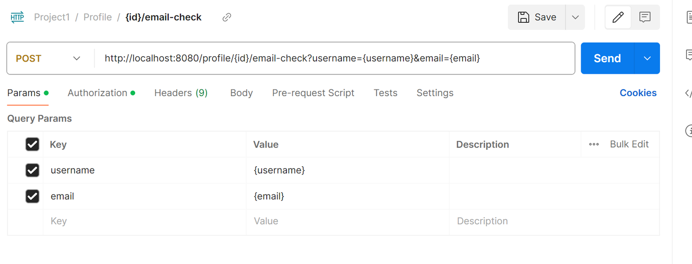
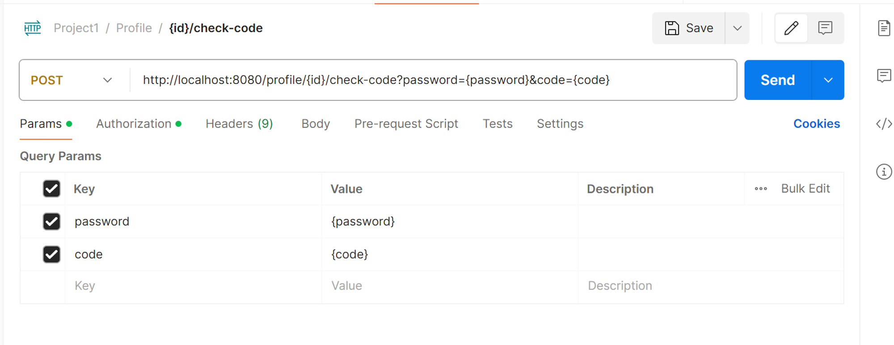
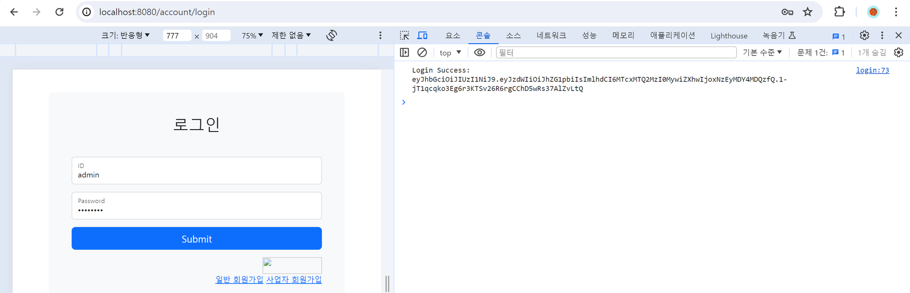

## 팀 구성원, 개인 별 역할

---

- 박지수: **팀장,** 인증, shop 생성, 아르바이트 등록, git 버전 관리
- 양동화: 근무표 확인 부분 제작, Jakarta Email 추가
- 이서주: 매장용 커뮤니티 제작
- 이영규: 출퇴근 관리 제작

## 팀 내부 회의 진행 회차 및 일자

---

| 날짜 | 진행방법 | 불참인원 |
| --- | --- | --- |
| 2024.03.26  | Discord | 이서주  |
| 2024.03.27 | Discord | X |
| 2024.03.28 | Discord | X |
| 2024.03.29 | Discord | X |

## 현재까지 개발 과정 요약

---

### 팀 개발 현황

- 급여 파트 분배 회의
    - 급여 부분의 프론트는 일단 생각하지 않고 백엔드만 고려한다.
    - 각자 개발과 시간상의 문제를 고려하여, 급여 계산 시에 추가적인 배경 (세금, 주휴수당 등)을 고려하지 않고 일한 시간을 바탕으로 간단하게 계산한다.
- 개발 상황 공유
    - mail 인증 부분 처리에 관하여
    - 일단 처음 회원가입 시에는 메일 인증 없이, `INACTIVE_USER`로 회원가입되도록 한다.
    - 회원가입 후 로그인 하게 된 페이지에서 메일 인증을 진행하면 `USER`로 승격되어 활동이 가능하게 한다.
- 각자 백엔드 부분 구현 완료
- 프론트엔드 진행중
- 화면 제작 완료 → 데이터 불러오기, 일부 페이지, security 적용, 페이지 통합 남아있음

### 팀원 개발 현황

- 박지수
    - 2024.03.26
        - jQuery ajax 구현 시도
            - 토큰의 발급은 제대로 되지만 `<script>` 구문을 추가해도 토큰이 제대로 전달되지 않았다.
            - Javascript의 버전 수정으로 현재는 확인이 가능하다.
        - Jakarta Mail 프론트에서 체크 가능하도록 구현
            - 프론트엔드 화면에서 회원가입을 시도했을 때, 작성한 메일로 메일이 보내지는 것은 확인했다.
            - 해당 메일의 문자와 동일한 문자를 입력했을 시에만 유효한 이메일로 체크가 되고, 회원가입이 완료되도록 설정 해야 한다.
            - 또는, `INACTIVE_USER`를 추가해 이메일이 체크되지 않은 유저는 비활성 유저인 채로 회원가입되게 하는 방법이 가능하다.
    - 2024.03.27
        - [x]  mail 인증 처리를 수정한다.
            - `INACTIVE_USER`의 권한을 추가해, 처음 계정을 생성했을 시에 `INACTIVE_USER`로 가입되게 만들었다.
            - `INACTIVE_USER`에서 특정 엔드포인트로 요청을 보내면, 입력한 이메일로 인증 코드가 담긴 메일이 전송된다.
                
                
                
            - 전송된 코트를 체크한다. 코드가 일치하여 인증에 성공한 경우,
                - 사업자 등록 번호가 없는 경우 → `ROLE_USER` 아르바이트생으로 권한을 변경한다.
                - 사업자 등록 번호가 있는 경우 → `ROLE_BUSINESS_USER` 매니저로 권한을 변경한다.
                
                
                
        - [x]  OAuth로 회원가입 후 로그인 시, redirect 경로를 변경한다.
            - 기존 경로는 토큰을 반환하는 페이지로 redirect 되도록 설정되어 있었다.
            
            ```java
            // 데이터베이스에서 사용자 계정 회수
            UserDetails details
                    = userDetailsManager.loadUserByUsername(username);
            // JWT 생성
            String jwt = tokenUtils.generateToken(details);
            log.info("Token: {}", jwt);
            
            // 어디로 리다이렉트 할지 지정
            // 현재는 임의로 토큰을 반환하는 페이지로 리다이렉트 설정해둠
            String targetUrl = String.format("http://localhost:8080/token/validate?token=%s", jwt);
            getRedirectStrategy().sendRedirect(request, response, targetUrl);
            ```
            
            - 토큰을 발급받아, `localhost:8080/profile/{id}`로 도달하게 하는 것이 목적이기 때문에 해당 경로를 수정했다.
            
            ```java
            // 데이터베이스에서 사용자 계정 회수
            UserDetails details
                    = userDetailsManager.loadUserByUsername(username);
            // JWT 생성
            String jwt = tokenUtils.generateToken(details);
            log.info("Token: {}", jwt);
            
            // Account DB에서 계정 가져옴
            Account account = accountRepo.findByUsername(details.getUsername())
                    .orElseThrow(() -> new ResponseStatusException(HttpStatus.NOT_FOUND));
            log.info("account ID: {}", account.getId());
            
            // 어디로 리다이렉트 할지 지정
            String targetUrl = String.format("http://localhost:8080/profile/%d", account.getId());
            getRedirectStrategy().sendRedirect(request, response, targetUrl);
            }
            ```
            
            - 추후 해당 토큰을 어떤 방식으로 프론트엔드에 전달해야 할지 고민해야 한다.
            - 프론트엔드에 전달된 토큰을 바탕으로 html 화면을 구상할 수 있도록 해야한다.
    - 2024.03.28
        - [x]  프로필 화면 불러오는 프론트엔드 완성하기
            - 권한 설정에 문제가 있는 것 같다.
            - 권한 없이는 `redirect`가 원할하게 일어나는데, 권한설정하면 페이지가 넘어가지 않음
            - 토큰이 로그인 된 페이지로 전달되는 것은 `consol`에서 확인 가능하다.
            - 일단 `security`를 `permitAll()`로 설정함 → 권한 확인 필요
        - [x]  로그아웃
            - 로그아웃하면 토큰 삭제되도록 설정
        - [x]  프로필 화면에 아르바이트 list 불러오기
            - Contoller로 `AccountShop`에 저장된 `ShopId`를 바탕으로 하는 `ShopName`을 불러올 수 있도록 설정함
            - html `<script>` 수정
    - 2024.03.29
        - [ ]  마이페이지에서 아르바이트 중인 매장 불러오기
            - 매장에 아르바이트 요청하면 메인 페이지에서 아르바이트 중인 매장 확인 가능
        - [x]  로그아웃 시 토큰 삭제
            - 로그아웃 -> 토큰 삭제 후 `home`으로 돌아감
        - [x]  로그인 후 email 체크 가능
            - 이메일 체크하면 `ROLE_USER` 또는 `ROLE_BUSINESS_USER`로 승격
        - [x]  OAuth 로그인 수정
            - OAuth 로그인 시 토큰이 반환되지 않는 오류 수정
            - 토큰 반환 가능
            - 로그인 데이터 로드 오류 -> OAuth로 로그인 시 등록되는 `username` 일치시켜 해결
        - [x]  매장 등록
            - 매장 CREATE 가능
        - [x]  매장 아르바이트 요청하기
            - 매장으로 아르바이트 요청 보낼 수 있음
            - 매장 이름으로 요청 보냄
            - 중복된 아르바이트 요청 보낼 수 없음
            - `ROLE_INACTIVE_USER`인 경우에도 아르바이트 요청 불가
- 양동화
    - 2024.03.26
        - test : 홈페이지 만지는중
    - 2024.03.27
        - **feat : salary**
            - body : create 기능
    - 2024.03.28
        - **feat : salary**
            - body : crud 추가 완료
            - tail : 에러는 없고 포스트맨으로 확인 중
    - 2024.03.29
        - **feat : schedule**
            - body : html만지는중
- 이영규
    - 2024.03.26
        - **해당매장에 다니는 사람인지 체크 로직 추가**
            
            scheduleService.checkMember(shopId) 메서드 활용하여, 해당 매장에 다니는 사람인지 체크하는 로직 주석으로 추가. 추후 주석 풀 예정
            
            주석을 한 이유?
            
            - checkMember 메서드는 권한을 체크하여 사용자의 계정아이디를 확인
                
                Postman 등이 아닌 브라우저에서 요청을 보낼 때 인증에 대한 정보 확인 되면 추후 주석 해제하여 바로 사용할 수 있도록 배치
                
        - **출퇴근 기록확인페이지 fix**
            
            출퇴근 데이터를 가져올 때 권한 확인하여 관리자/일반사용자용 데이터를 가져오도록 fix
            
            1. 일반 사용자가 하나의 매장에 소속되었을 때
            2. 일반 사용자가 여러 매장에 소속되었을 떄
            3. 한 관리자가 한 매장에 소속되었을 때
            4. 한 관리자가 여러 매장에 소속되었을 때
            
            이렇게 네 가지 경우를 적용
            
    - 2024.03.27
        - [ ]  출퇴근 기록 페이지 닉네임 추가
        - [x]  페이징 - 내 데이터의 크기만큼 페이징되도록 반영(페이지개수 / 페이지크기)
            
            querydsl로 데이터를 가져올 때 Page의 offset과 limit로 페이징 데이터 리턴
            
            총 데이터개수를 받아오도록 추가 
            
            - 총 데이터개수 가져올 때 limit와 offset 넣어져 오류 발생하던 부분 제거
        - [x]  페이지 버튼 클릭 시 동작하도록 반영
            
            특정 매장으로 검색한 화면에서 페이지버튼을 누르면 오동작 현상 발견
            
            링크에 shopId 확인하여 분기하는 부분 추가
            
    - 2024.03.28
        - [ ]  출퇴근 기록 페이지 검색 기능 추가
            
            자신의 기록을 검색하여 확인하는 기능을 추가하고자 함
            
            검색 기간 / 검색 타입(매장명/상태) / 검색어로 기록 검색 
            
            쿼리의 경우 기존 출퇴근 기록 페이지의 것을 참고하여 새로 만들 것
            
             where 조건절에 추가조건을 걸어, 원하는 부분을 찾아낼 수 있도록 진행
            
            - 검색 기간의 경우 LocalDateTime의 메서드 활용
        
        ---
        
        - [x]  출퇴근 기록 페이지 기능 / 검색타입 / 검색어 부분 front 추가
        
        ---
        
        - [x]  검색기능 controller 작성
    - 2024.03.29
        - [ ]  검색기능 service단 작성
        - [x]  검색기능 쿼리 작성
            
            BooleanExpression으로 where절 메서드 작성. 기존 출퇴근기록 페이지 데이터를 가져오는 쿼리에 where절을 덧붙여 사용
            
        - [x]  검색기능 동작 확인
            
            관리자일 때 검색결과의 데이터 중 하나를 수정하면, 출퇴근기록 페이지로 넘어간다. 
            
            이 부분은 추후 페이지 전체수정 기능을 작성하게 되면 추가
            
- 이서주
    - 2024.03.27
        - 비밀 게시판 조회 권한 컨트롤러로 로직 변경
        - password 폼 작업
    - 2024.03.28
        - test project -> work-mate project 전환
        - token으로 accountId 연결
    - 2024.03.29
        - 게시판 접근 권한 설정 (shopId-accountId)
        - 관리자 글 / 댓글 삭제 권한 부여
        - 관리자 비밀글 조회 권한 부여
        - 게시글 수정 권한 관련 수정
        - 공지사항은 business_user, admin만 작성 권한
        - comment 유저정보 더하기
        - 수정, 삭제, 등록 alert 메세지 추가
        - VIEW 다듬기

## 개발 과정에서 나왔던 질문

---

### Error

- JQuery AJAX 구현 시도 중 Error
    1. 백엔드 서버에서 생성된 토큰을 프론트엔드로 가져오지 못했다.
        
        프론트엔드에서 로그인 폼을 제출하면 아래와 같은 오류가 발생했다.
        
        ```bash
        2024-03-26T16:21:48.840+09:00  WARN 15844 --- [nio-8080-exec-7] .w.s.m.s.DefaultHandlerExceptionResolver : Resolved [org.springframework.web.HttpMediaTypeNotSupportedException: Content-Type 'application/x-www-form-urlencoded;charset=UTF-8' is not supported] 
        ```
        
        `JwtResponseDto`와 `JwtRequestDto`가 `@Getter`만 설정되어있어 받아오지 못하는 것 같았다.
        
        `@Data`로 어노테이션을 수정해 각각 Dto에서 데이터를 받아올 수 있도록 설정했다.
        
        설정을 변경하고 시도했음에도 동일한 에러가 발생했다.
    
    1. JSON 데이터가 제대로 전달되고 있지 않다고 판단했다.
        
        ```jsx
        // 폼 데이터를 JSON 객체로 변환
        const formData = {
            username: $('#identifier').val(),
            password: $('#password').val()
        };
        ```
        
        폼 데이터를 JSON 객체로 반환하는 Script에서 전달받는 JSON 값을 아래와 같이 변경했다.
        
        ```jsx
        // 폼 데이터를 JSON 객체로 변환
        const formData = {
            username: $('input[name="username"]').val(),
            password: $('input[name="password"]').val()
        };
        ```
        
        설정을 변경하고 시도했음에도 동일한 에러가 발생했다.
  3. JavaScript 버전 자체의 오류라고 판단해 해당 `login-form.html`의 `<script>`의 버전을 달리 설정했다.
    
        ```html
        <script src="https://code.jquery.com/jquery-3.6.0.min.js" integrity="sha384-KyZXEAg3QhqLMpG8r+Knujsl5+YE2JnLG63L/T/v/h0aiot4Bpey2O5qk4M5h1Jj" crossorigin="anonymous"></script>
        ```
    
        원래 위의 버전을 하위의 버전으로 변경했다.
    
        ```html
        <script src="https://code.jquery.com/jquery-3.4.1.min.js"></script>
        ```
    
        설정을 변경하고 시도했음에도 동일한 에러가 발생했다.
    
  4. JavaScript 버전 자체의 오류라고 판단해 해당 `login-form.html`의 `<script>`의 버전을 달리 설정했다.
        
     ```html
     <script src="https://code.jquery.com/jquery-3.6.0.min.js" integrity="sha384-KyZXEAg3QhqLMpG8r+Knujsl5+YE2JnLG63L/T/v/h0aiot4Bpey2O5qk4M5h1Jj" crossorigin="anonymous"></script>
     ```
        
     원래 위의 버전을 하위의 버전으로 변경했다.
        
     ```html
     <script src="https://code.jquery.com/jquery-3.4.1.min.js"></script>
     ```
        설정을 변경하고 시도했음에도 동일한 에러가 발생했다.
    
  5. HTML과 Data를 반환하는 Controller에 문제가 있다고 판단해 Controller의 분리를 시도했다.
        
     - 원래 `@Controller`로 선언되어 있는 `AccountController`에서 login의 `POST`를 분리했다.
        
     -  `AccountController`에선 login-form.html을 반환하게 하고, 토큰을 반환할 수 있는 `@RestController`를 분리했다.
        
           - `AccountController`
        
           ```java
           @GetMapping("/login")
           public String loginForm() {
               return "account/login-form";
           }
           ```
        
           - `AccountRestController`
        
           ```java
           @Slf4j
           @RestController
           @RequestMapping("/account")
           @RequiredArgsConstructor
           public class AccountRestController {
               private final UserDetailsManager manager;
               private final PasswordEncoder passwordEncoder;
               private final AccountRepo accountRepo;
               private final JwtTokenUtils tokenUtils;
        
               @PostMapping("/login")
               public JwtResponseDto login(
                       @RequestBody JwtRequestDto dto
               ) {
                   if (!manager.userExists(dto.getUsername())) {
                       throw new ResponseStatusException(HttpStatus.NOT_FOUND);
                   }
        
                   UserDetails userDetails = manager.loadUserByUsername(dto.getUsername());
                   log.info("username: {}", userDetails.getUsername());
                   log.info("password: {}", userDetails.getPassword());
        
                   if (!passwordEncoder.matches(dto.getPassword(), userDetails.getPassword())) {
                       log.error("비밀번호가 일치하지 않습니다.");
                       throw new ResponseStatusException(HttpStatus.BAD_REQUEST);
                   }
        
                   Account account = accountRepo.findByUsername(dto.getUsername())
                           .orElseThrow(() -> new ResponseStatusException(HttpStatus.NOT_FOUND));
                   log.info("account Id: {}", account.getId());
        
                   JwtResponseDto response = new JwtResponseDto();
                   response.setToken(tokenUtils.generateToken(userDetails));
                   log.info("token: {}", response.getToken());
        
                   return response;
               }
           }
           ```
        RestController와 일반 Controller를 분리해 처리를 시도하니, 콘솔에서 로그인 성공했을 시에 토큰이 정상적으로 전달되는 것을 확인할 수 있었다. 
    
        
    
        해당 토큰을 이용하여 로그인 이후 나올 페이지로 Redirect하는 방법을 찾을 예정이다.
    

### 개발 결과물 공유

---

[GitHub - likelion-backend-8th-albamonster/work-mate](https://github.com/likelion-backend-8th-albamonster/work-mate)